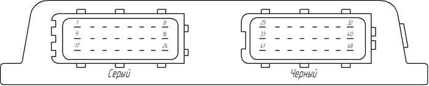

# Распиновка ЭБУ Megasquirt

| № | Название | Тип | Ток (A) | Описание |
|:-:|:--------:|:----:|:--:|:---------|
| 1 | GND | вход | - | Земля  |
| 2 | IGN 1 | выход | 0.05 | Канал зажигания 1 (A) |
| 3 | IGN 2 | выход | 0.05 | Канал зажигания 2 (B) |
| 4 | IGN 3 | выход | 0.05 | Канал зажигания 3 (C) |
| 5 | IGN 4 | выход | 0.05 | Канал зажигания 4 (D) / JS11 |
| 6 | IGN 5 | выход | 0.05 | Канал зажигания 5 (E) / (ADC_06) |
| 7 | IGN 6 | выход | 0.05 | Канал зажигания 6 (F) / (ADC_07) |
| 8 | +12 | вход | - | Питание ЭБУ +12В |
| 9 | GND | вход | - | Земля  |
| 10 | IAC 1 | выход | 1 | Программируемый выход   |
| 11 | IAC 2 | выход | 1 | Программируемый выход   |
| 12 | FP 1 | выход | 0.5 | Реле топливного насоса |
| 13 | O1A (IAC 1) | выход | 0.3 | Выход шагового РХХ |
| 14 | O1B (IAC 1) | выход | 0.3 | Выход шагового РХХ |
| 15 | O2B (IAC 2) | выход | 0.3 | Выход шагового РХХ |
| 16 | O2A (IAC 2) | выход | 0.3 | Выход шагового РХХ |
| 17 | FP 2 | выход | 0.5 | Реле потребителей |
| 18 | Fidle  | выход | 1 | Выход РХХ инвертированный |
| 19 | Fidle  | выход | 1 | Выход РХХ неинвертированный |
| 20 | INJ 4 | выход | 1 | Канал форсунки 4 |
| 21 | INJ 3 | выход | 1 | Канал форсунки 3 |
| 22 | INJ 2 | выход | 1 | Канал форсунки 2 |
| 23 | INJ 1 | выход | 1 | Канал форсунки 1 |
| 24 | +12 | выход | 0.5 | Питание обмоток реле FP1 и FP2 |
| 25 | GND | выход | 0.1 | Земля датчиков и экранов |
| 26 | CKP+ | вход | - | ДПКВ + |
| 27 | CKP- | вход | - | ДПКВ - |
| 28 | CLNT | вход | - | ДТОЖ |
| 29 | PE0 | вход | - | Программируемый вход (цифровой) |
| 30 | PE1 | вход | - | Программируемый вход (цифровой) |
| 31 | ADC_06 | вход | - | АЦП |
| 32 | Tacho | выход | - | Сигнал тахометра 12В (ADC_07) |
| 33 | +5 | выход | - | Питание датчиков +5В |
| 34 | CMP- | вход | - | ДПРВ - |
| 35 | CMP+ | вход | - | ДПРВ + |
| 36 | CAN H | выход | - | CAN шина |
| 37 | CAN L | выход | - | CAN шина |
| 38 | - | - | - | - |
| 39 | - | - | - | - |
| 40 | - | - | - | - |
| 41 | +12 | выход | 0.03 | Питание датчиков +12В |
| 42 | EG0 | вход | - | Сигнал УДК/ШДК |
| 43 | TPS | вход | - | ДПДЗ |
| 44 | MAT | вход | - | ДТВ |
| 45 | MAP | вход | - | ДАД |
| 46 | - | - | - | - |
| 47 | - | - | - | - |
| 48 | - | - | - | - |

## Аббревиатуры

| | |
|:--:|:-----|
| ШДК | Широкополосный датчик кислорода |
| УДК | Узкополосный датчик кислорода |
| ДАД | Датчик абсолютного давления |
| ДТВ | Датчик температуры воздуха |
| ДПДЗ | Датчик положения дроссельной заслонки |
| РХХ | Регулятор холостого хода |
| ДПКВ | Датчик положения коленчатого вала |
| ДПРВ | Датчик положения распределительного вала |
| АЦП | Аналого-цифровой преобразователь |
| ДД | Датчик детонации |

## Конфигурация

Рекомендуемый рабочий диапазон с различными триггерами:

60-2 –7000 об/мин 
36-1 –11000 об/мин 
24-1 - 16000 об/мин 
12-1 - 25000 об/мин 
